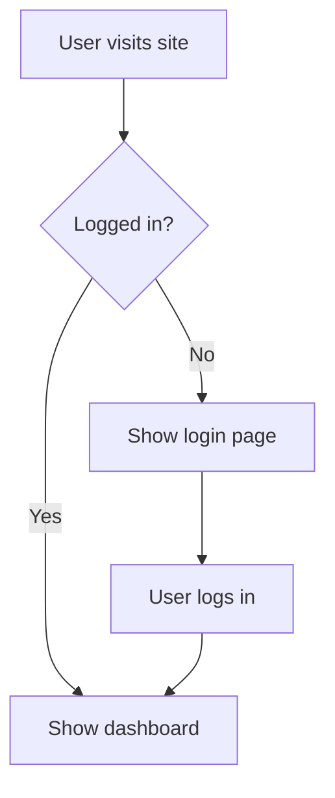

# My Flowchart

Here’s how our login flow works:

```mermaid
flowchart TD
  A[User visits site] --> B{Logged in?}
  B -- Yes --> C[Show dashboard]
  B -- No  --> D[Show login page]
  D --> E[User logs in]
  E --> C
```
